Abstract
========

This application note contains the project that is used in the webinar
"[How to get started with Arm Cortex-M55 software
development](https://www.brighttalk.com/webcast/17792/386144)". It
explains the project is explained in-depth and repeats the steps that
were shown.

The project itself contains four different implementations of a
multiply-accumulate (MLA) function. It is explained how the
implementations differ and what performance gains you can expect when
using optimized code on Arm Cortex-M55. The project can run on a Fixed
Virtual Platform (FVP) model that is shipped with MDK v5.30, requiring
an [MDK-Professional](http://www2.keil.com/mdk5/editions/pro) license.

Contents {#contents .TOC-Heading}
========

[Abstract 1](#abstract)

[Introduction 2](#introduction)

[Prerequisites 2](#prerequisites)

[Project Structure 2](#project-structure)

[Software Components 2](#software-components)

[main.c 2](#main.c)

[mla\_functions.S 4](#mla_functions.s)

[Running the project 4](#running-the-project)

[Targets 4](#targets)

[FVP -- Scalar only implementation 5](#fvp-scalar-only-implementation)

[Code Coverage 5](#code-coverage)

[M-Profile Vector Extension window
7](#m-profile-vector-extension-window)

[FVP -- Data type optimized vector implementation
7](#fvp-data-type-optimized-vector-implementation)

[MPS3 - Data type optimized vector implementation
8](#mps3---data-type-optimized-vector-implementation)

[Code Coverage 9](#code-coverage-1)

[Performance Analyzer 10](#performance-analyzer)

[MPS3 -- Reducing Execution Time Using Component Viewer
11](#mps3-reducing-execution-time-using-component-viewer)

[Variables.scvd 12](#variables.scvd)

[Results 13](#results)

[Summary 13](#summary)

[Appendix 13](#appendix)

Introduction
============

This application note explains how to implement four different versions
of a multiply-accumulate function on Arm Cortex-M55. You will learn how
to use the performance monitoring unit (PMU) to examine the differences
in computing performance. Also, some debugging concepts of MDK are
discussed and used.

Finally, the application note quickly touches on the usage of MDK with
the Arm MPS3 prototyping board that can host the netlist of Arm
Cortex-M55 and that enables real code profiling using target hardware.

Prerequisites
-------------

To run the project, you need to install the following software:

-   Install MDK v5.30 from
    [www.keil.com/demo/eval/arm.htm](http://www.keil.com/demo/eval/arm.htm)

-   Add an MDK-Professional license. If you do not have access to this
    MDK edition, you can request a 30-day trial license from within the
    tool:
    [www.keil.com/support/man/docs/license/license\_eval.htm](http://www.keil.com/support/man/docs/license/license_eval.htm)

Project Structure
=================

The project is configured for the Arm Cortex-M55 and has basically two
source files:

-   main.c contains the main() function and calls the different
    implementations of the MLA function.

-   mla\_functions.S is an assembly file that contains the different MLA
    implementations

The MLA implementations are as follows:

-   Scalar only MLA function implementation.

-   Scalar MLA function implementation with low-overhead loops (LOL)
    (refer to Appendix).

-   Vectorized MLA function implementation with scalar code for loop
    tail prediction (refer to Appendix).

-   Vectorized MLA function implementation with low-overhead loops
    (refer to Appendix).

The project also contains a custom scatter file (ARMC55\_ac6.sct) that
is used to place one of the software components in an uninitialized part
of the target's memory.

Software Components
-------------------

Apart from the two source files, the project contains the following
software components:

-   **::CMSIS:Core** for access to the Cortex-M55 header file

-   **::Device:Startup** for startup and systems files

-   **::Compiler:Event Recorder** and **::Compiler:I/O:STDOUT:EVR** for
    [retargeting the printf()
    output](http://www.keil.com/pack/doc/compiler/RetargetIO/html/_retarget__examples_er.html)
    to the **Debug (printf) Viewer** window

main.c
------

In main.c, we first include a couple of required header files. The
EventRecorder.h file is only included if the component is present (which
is noted in RTE\_Components.h). This will be used in the last step when
we remove the component and thus don't want to include its header file:

\#include \"RTE\_Components.h\"

\#include CMSIS\_device\_header

\#ifdef RTE\_Compiler\_EventRecorder

  \#include \"EventRecorder.h\" // Keil.ARM Compiler::Compiler:Event Recorder

\#endif

\#include \<stdio.h\>

After that, we create variables that will be used to compute the results
based on the \#defines as shown below

\#define LENGTH 127

\#ifndef DATATYPE

extern int mla\_sca(int a\[\], int b\[\], int n);

extern int mla\_sca\_lol(int a\[\], int b\[\], int n);

extern int mla\_vec(int a\[\], int b\[\], int n);

extern int mla\_vec\_lol(int a\[\], int b\[\], int n);

int a\[LENGTH\];

int b\[LENGTH\];

\#else

extern int mla\_sca(short a\[\], short b\[\], short n);

extern int mla\_sca\_lol(short a\[\], short b\[\], short n);

extern int mla\_vec(short a\[\], short b\[\], short n);

extern int mla\_vec\_lol(short a\[\], short b\[\], short n);

short a\[LENGTH\];

short b\[LENGTH\];

\#endif

volatile uint32\_t scalar\_cycle\_count        = 0;

volatile uint32\_t scalar\_lol\_cycle\_count    = 0;

volatile uint32\_t vector\_scalar\_cycle\_count = 0;

volatile uint32\_t vector\_lol\_cycle\_count    = 0;

Next, there is an initialization function that is used to fill the
variables with data that will be used for the MLA function:

\_\_attribute\_\_((noinline)) void init\_arrays(void) {

  int i;

  for (i = 1; i \< (LENGTH + 1); i++) {

    a\[i - 1\] = i;

    b\[i - 1\] = i;

  }

}

In main(), (based on availability) we initialize Event Recorder, enable
the PMU and its cycle counter. Then we initialize the array and start
doing the calculations with four different implementations. These
calculations are enclosed in calls to the cycle counter to retrieve the
required information to measure the application performance. The value
is then stored in a variable that is printed on the debug console:

int main(void) {

\#ifdef RTE\_Compiler\_EventRecorder

  EventRecorderInitialize(EventRecordAll, 1);

\#endif

  ARM\_PMU\_Enable();

  ARM\_PMU\_CNTR\_Enable(PMU\_CNTENSET\_CCNTR\_ENABLE\_Msk);

  init\_arrays();

  cycle\_count\_before = ARM\_PMU\_Get\_CCNTR();

  sca\_result = mla\_sca(a, b, LENGTH);

  cycle\_count\_after = ARM\_PMU\_Get\_CCNTR();

  scalar\_cycle\_count = cycle\_count\_after - cycle\_count\_before;

\#ifdef RTE\_Compiler\_EventRecorder

  printf(\"Scalar only          : Result = %d, Cycles = %d\\n\", sca\_result, scalar\_cycle\_count);

\#endif

mla\_functions.S
----------------

The capital "S" in the file extension indicates to the Arm assembler
that the file requires preprocessing as it contains a couple of
\#ifndefs that are used to steer the selected implementation. To see the
best result of each implementation, you need to set the following
\#defines in the **Options for Target -- C/C++ (AC6) and Asm** tabs:

  **Result of**     **C/C++ (AC6) tab**   **Asm tab**
  ----------------- --------------------- -------------
  Scalar only                             PLAIN
  Scalar LOL                              SCALOL
  Vector LOL                              VECLOL
  Optimized types   DATATYPE              DATATYPE

The last one uses different data types than the others (also in main.c).
Instead of 32-bit integers, 16-bit fixed-point values are used that
enable higher throughput in a single iteration.

Running the project
===================

This section explains a couple of ways to execute the application in
simulation or on real hardware. It also shows how to use MDK to debug
the application and how to optimize the debug experience.

The project ZIP file is available for download on
[www.keil.com/appnotes/docs/apnt\_329.asp](http://www.keil.com/appnotes/docs/apnt_329.asp).
Download the ZIP file, unzip it, and double-click the Cortex-M55.uvprojx
file to open it in µVision.

Targets
-------

The project supports two targets:

-   **FVP**: The project runs in simulation using the Cortex-M55 FVP
    that is delivered with MDK. An FVP is useful for prototyping as it
    gives an indication about code performance. However, it does not
    give accurate measurements.

-   **MPS3**: The project connects to a Cortex-M55 FPGA image running on
    the MPS3 prototyping platform. Using a hardware implementation gives
    you accurate code performance measurements.

```{=html}
<!-- -->
```
-   Note: General information on how to use Fixed Virtual Platforms in
    MDK can be found here:
    [www.keil.com/support/man/docs/fstmdls/](http://www.keil.com/support/man/docs/fstmdls/)

FVP -- Scalar only implementation
---------------------------------

First, we need to tell the assembler to use the right implementation. Go
to {width="0.16664588801399824in"
height="0.15623031496062992in"} **Options for Target -- Asm** (Atl+F7)
and enter PLAIN in the **Define:** section:

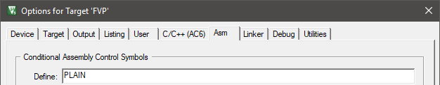{width="6.520018591426072in"
height="1.2706747594050745in"}

 **Build** (F7) the project and
{width="0.16664588801399824in"
height="0.15623031496062992in"} **Start a Debug Session** (Ctrl + F5).
You will see two windows opening in the background -- these are issued
by the Fast Model and must not be closed during the debug session.

 **Run** (F5) the application. It
will hit a breakpoint at the end on the while(1) loop. Observe the
output of the printf() calls in the **Debug (printf) Viewer** window:

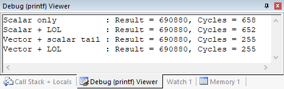{width="4.863975284339458in"
height="1.531058617672791in"}

Note that the cycles do not have to match to your output, but the
general relation should be correct.

### Code Coverage

 **Stop the Debug Session** (Ctrl
+ F5) and restart it immediately afterwards. You will notice that the
display of your code has changed. It now contains code coverage
markings:

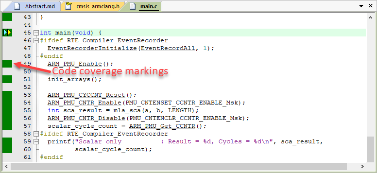{width="7.0in"
height="3.2111111111111112in"}

This is due to a new feature in MDK v5.30 that allows to extract
coverage information from an FVP. Unfortunately, this cannot be shown
live in a debug session, but needs to be loaded when entering debug.

In the **Models ARMv8-M Target Driver Setup** dialog, you can specify to
save the coverage information and to load a recorded coverage info on
debug entry
({width="0.16664588801399824in"
height="0.15623031496062992in"} **Options for Target -- Debug --
Settings** (Alt+F7)):

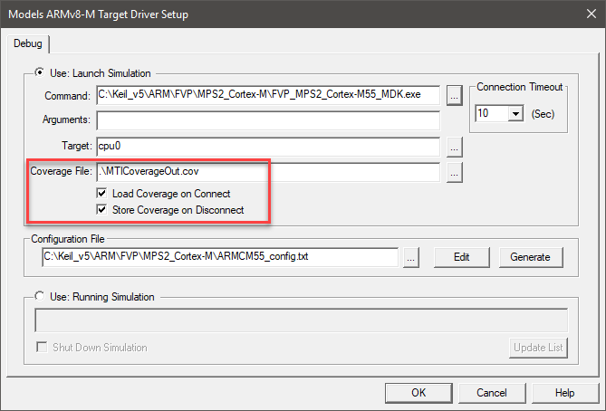{width="6.9678794838145235in"
height="4.728575021872266in"}

In a debug session with the data loaded from the previous run, you can
use the COVERAGE command to store the coverage information in
[Gcov](https://gcc.gnu.org/onlinedocs/gcc/Gcov.html) format. This is
useful for CI/CD environments where your server can run automated
testing and create coverage information based on GCOV. Enter the
following in the **Command** window:

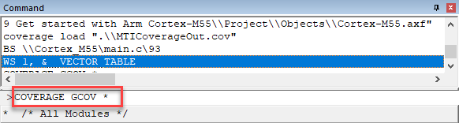{width="6.061742125984252in"
height="1.6247965879265092in"}

The Gcov files (one for each module) will be saved in the directory
where the objects are stored. You can use a tool like
[gcovr](https://gcovr.com/en/stable/) to create a HTML table showing the
project's overall code coverage.

### M-Profile Vector Extension window

MDK v5.30 introduces a new System Viewer window -- the [**M-Profile
Vector
Extension**](http://www.keil.com/support/man/docs/uv4/uv4_cp_armv81mml_mve.htm)
window. This window allows you to check the MVE vector registers.

 Go to **View -- System Analyzer
-- Core Peripherals -- M-Profile Vector Extension (MVE)** to open the
dialog:

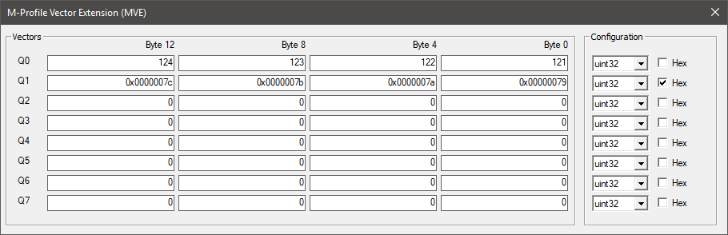{width="7.0in"
height="2.261111111111111in"}

The **Vectors** area displays the values of vectors Q0 - Q7. The
Cortex-M55 works in parallel on 2 x 64-bit vectors. You can configure
the display of this window to show the native number format that you are
using in your algorithms, from 64-bit down to 8-bit. You can specify to
see the content of the vector register in int, float, or even q number
format. This makes it easy to verify the correct operation of your
application.

FVP -- Data type optimized vector implementation
------------------------------------------------

To see the best performance of the MLA algorithm, we need not only to
use an optimized variant, but also change the data type. When creating
DSP applications, developers often work on 16-bit values and fixed-point
representation. This data type usually provides enough precision but
offers a smaller memory footprint and increases performance. Combined
with MVE, this means up to eight different elements can be processed in
a single iteration of a loop.

To examine the impact on performance of switching to use a smaller data
type, define DATATYPE in the\
{width="0.16664588801399824in"
height="0.15623031496062992in"} **Options for Target -- Asm** (Atl+F7)
**Define:** section and
{width="0.16664588801399824in"
height="0.15623031496062992in"} **Options for Target -- C/C++ (AC6)
Define:** section:

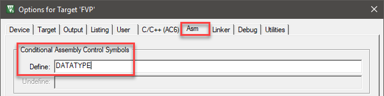{width="6.520018591426072in"
height="1.645627734033246in"}

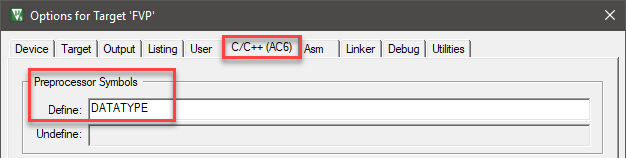{width="6.520018591426072in"
height="1.645627734033246in"}

 **Rebuild** the project,
{width="0.16664588801399824in"
height="0.15623031496062992in"} **Start a Debug Session** (Ctrl + F5),
and
{width="0.16666666666666666in"
height="0.15625in"} **Run** (F5) the application. You should see results
like the following ones:

{width="4.863975284339458in"
height="1.5206430446194226in"}

Comparing the different results, we see that an optimized implementation
of an algorithm with the right selection of the variable data types can
increase performance significantly. In our case, the Vector + LOL
version is more than 6.5 times faster than the simple scalar
implementation. Let's see how the numbers are on a real hardware
implementation in an FPGA.

MPS3 - Data type optimized vector implementation
------------------------------------------------

For this next part, you need to have access to the [Arm MPS3 FPGA
Prototyping
Board](https://developer.arm.com/tools-and-software/development-boards/fpga-prototyping-boards/mps3).
It features a large FPGA that lets designers implement complex embedded
designs. It offers various debug connectors, including the [20-pin
Cortex + ETM debug
connector](http://www2.keil.com/coresight/coresight-connectors/#etm).
Connecting a [ULINKpro](http://www2.keil.com/mdk5/ulink/ulinkpro) debug
and trace unit to this connector gives access to full instruction trace
that you can use for code coverage and profiling.

**Hardware setup**

1.  Connect the ULINKpro to your computer and to J12 on the MPS3

2.  Connect the MPS3 power supply

3.  Press the PBON button to load the FPGA image

**Run the application**

In µVision, switch the target to **MPS3**:

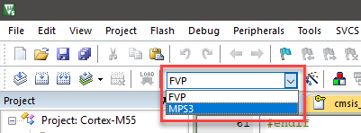{width="4.1765616797900265in"
height="1.5414741907261593in"}

Make sure that the define DATATYPE is still set on the **C/C++ (AC6)**
and **Asm** tabs.

{width="0.16666666666666666in"
height="0.15625in"} **Build** (F7) the project,
{width="0.16664588801399824in"
height="0.15623031496062992in"} **Start a Debug Session** (Ctrl + F5),
and
{width="0.16666666666666666in"
height="0.15625in"} **Run** (F5) the application. It will hit a
breakpoint at the end on the while(1) loop. Observe the output of the
printf() calls in the **Debug (printf) Viewer** window:

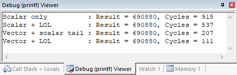{width="4.863975284339458in"
height="1.5414741907261593in"}

Notice that the Vector + LOL implementation needs more cycles than
estimated with the model, but the relation to the Scalar implementation
is roughly right: in real life it is even more than eight times faster
than the simple implementation.

### Code Coverage

Notice that the code is already annotated with coverage information once
you run through it. This is an advantage when using real hardware. You
can also use the **Code Coverage** window to check the coverage for each
module/function:

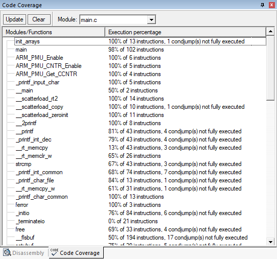{width="5.645127952755906in"
height="5.280589457567804in"}

As before, you can write coverage information to a Gcov file for further
processing.

### Performance Analyzer

Using ETM trace you also get access to **Performance Analyzer**.
ULINK*pro* allows applications to be run for long periods of time while
collecting trace information. This is used by **Performance Analyzer**
to record and display execution times for functions and program blocks.
It shows the processor cycle usage and enables you to identify
algorithms that require optimization.

 Go to **View -- Analysis Windows
-- Performance Analyzer** to open the window:

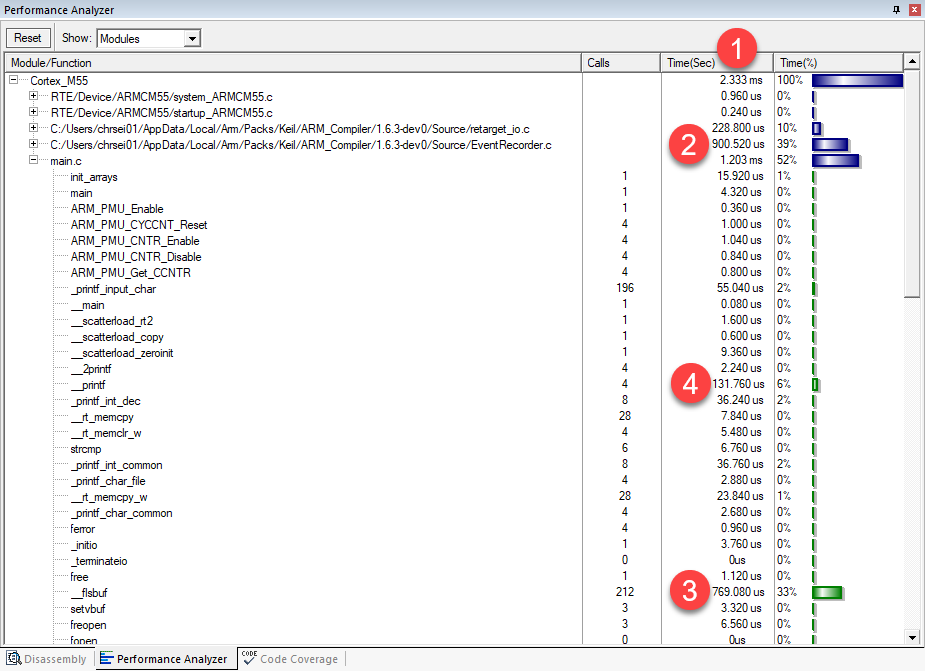{width="7.0in"
height="5.0777777777777775in"}

The following is quite interesting:

1.  The overall execution time is 2.333 ms

2.  Almost 40% of the execution time was spent in the Event Recorder
    component

3.  \_\_flsbuf (the Arm implementation of fputc) is eating up another
    33%

4.  printf itself requires another 6%

Putting all together, we can see that in such a simple project, the
dominating factor is printing the output to a console. In the next
section, we will see how we can improve this.

MPS3 -- Reducing Execution Time Using Component Viewer
------------------------------------------------------

 **Stop the Debug Session** (Ctrl
+ F5) and open the
{width="0.16664588801399824in"
height="0.15623031496062992in"} **Manage Run-Time Environment** window.
Disable the following components:

-   **::Compiler:Event Recorder**

-   **::Compiler:I/O:STDOUT**

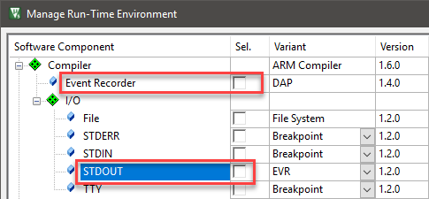{width="5.051452318460193in"
height="2.3434569116360455in"}

Click **OK** to close the window.

In main.c, you immediately see that the relevant code will not be used
as the RTE\_Component.h file does not contain the define
RTE\_Compiler\_EventRecorder anymore:

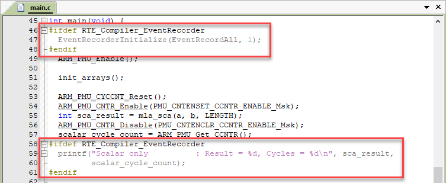{width="7.0in"
height="2.8722222222222222in"}

Instead of using printf() for displaying the variables, you could add
them to the
[**Watch**](http://www.keil.com/support/man/docs/uv4/uv4_db_dbg_watchwin.htm)
window, but this requires the variables to be in scope and does not
render nicely (the variable name and value is shown, that's it). Another
option is to use [**Component
Viewer**](http://www.keil.com/support/man/docs/uv4/uv4_db_dbg_scvd_viewer.htm)
to create your own window to view to the variables by just adding a
simple XML file to the project.

Go to
{width="0.16664588801399824in"
height="0.15623031496062992in"} **Options for Target -- Debug** (Atl+F7)
and click **Manage Component Viewer Description Files ...** at the
bottom of the dialog. In the next window, click **Add Component Viewer
Description File** and browse to the file Variables.scvd in the project
directory, and click **Add**:

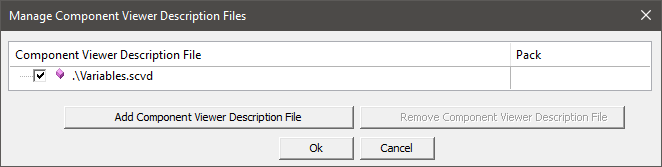{width="6.894971566054243in"
height="1.7393657042869641in"}

Click **OK** twice.

### Variables.scvd

Here is the content of the SCVD file:

\<?xml version=\"1.0\" encoding=\"utf-8\"?\>

\<component\_viewer schemaVersion=\"0.1\" xmlns:xs=\"http://www.w3.org/2001/XMLSchema-instance\" xs:noNamespaceSchemaLocation=\"Component\_Viewer.xsd\"\>

\<component name=\"MyVars\" version=\"1.0.0\"/\>

  \<objects\>

    \<object name=\"MyVars\"\>

      \<read name=\"SCNT\"  type=\"uint32\_t\" symbol=\"scalar\_cycle\_count\"/\>

      \<read name=\"SLCNT\" type=\"uint32\_t\" symbol=\"scalar\_lol\_cycle\_count\"/\>

      \<read name=\"VSCNT\" type=\"uint32\_t\" symbol=\"vector\_scalar\_cycle\_count\"/\>

      \<read name=\"VLCNT\" type=\"uint32\_t\" symbol=\"vector\_lol\_cycle\_count\"/\>

      \<out name=\"Cycle Counts\"\>

        \<item property=\"Scalar Cycle Count\"                      value=\"%d\[SCNT\]\" /\>

        \<item property=\"Scalar Low-overhead-loop Cycle Count\"    value=\"%d\[SLCNT\]\"/\>

        \<item property=\"Vectorized Scalar Cycle Count\"           value=\"%d\[VSCNT\]\"/\>

        \<item property=\"Vectorized Low-overhead-loopCycle Count\" value=\"%d\[VLCNT\]\"/\>

      \</out\>

    \</object\>

  \</objects\>

\</component\_viewer\>

Basically, you create the objects, that you want to display in the
window by reading program symbols. Then you tell the window how to
display these objects (items) in a consistent way (using printf-style
formatting).

### Results

 **Rebuild** the project,
{width="0.16664588801399824in"
height="0.15623031496062992in"} **Start a Debug Session** (Ctrl + F5)
and go to **View -- Watch Windows -- Cycle Counts** to open the
Component Viewer window.
{width="0.16666666666666666in"
height="0.15625in"} **Run** (F5) the application. The **Cycle Counts**
window shows the following results:

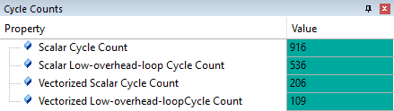{width="4.572344706911636in"
height="1.2915048118985126in"}

**Performance Analyzer** now shows a different picture:
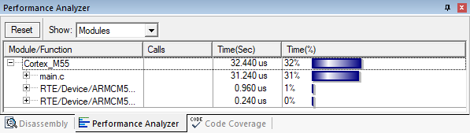{width="6.217972440944882in"
height="1.7601968503937009in"}

Using a less invasive method of reading the variables, we could reduce
the overall run-time of the application drastically.

Summary
=======

This application note showed how you can use the Fixed Virtual Platforms
(FVPs) that are shipped with Arm Keil MDK to start early prototyping of
your software or architecture exploration without real hardware. It
explained that this method is suitable for benchmarking your application
code, while not having access to a target device.

It was also shown that using a prototyping board, advanced features of
Arm Keil MDK help you to profile your application further and how these
features can help to reduce the overall run-time of the program.

Appendix
========

Here are some useful resources regarding the Armv8.1-M architecture:

1.  [White paper: Introducing the new Armv8.1-M
    architecture](https://pages.arm.com/introduction-armv8.1m.html)

2.  [Armv8-M Architecture Reference Manual
    Documentation](https://developer.arm.com/docs/ddi0553/latest)

3.  [Cortex-M55 on developer.arm.com](developer.arm.com/cortex-m55)
